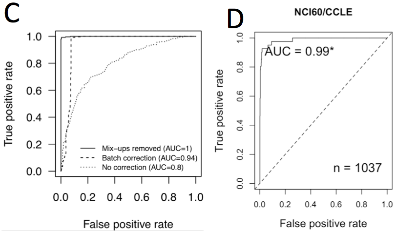
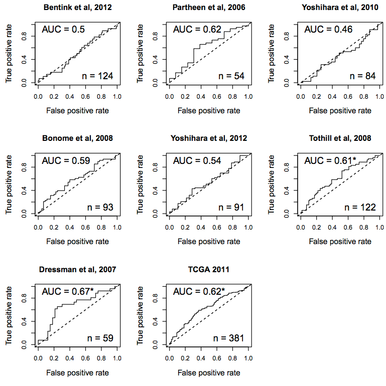
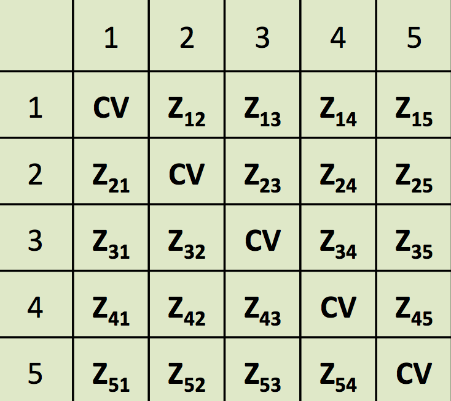

```{r setup, cache=FALSE, echo=FALSE}
library(knitr)
# global chunk options
opts_chunk$set(cache=TRUE, autodep=TRUE)
```

## Outline

- Preparation for meta-analysis
- Fixed and Random Effects Synthesis
- Assessing Heterogeneity
- Leave-one-dataset-in and Leave-one-dataset-out Validation of Prediction Models
- `curatedMetagenomicData` and `MultiAssayExperiment`

## Scope: what is meta-analysis?

- Broad definition: the full scope of among-study analysis
- Narrow definition: a synthesis of per-study estimates
- Not: pooling of per-patient data ("mega-analysis")

> “We understand meta-analysis as being the use of statistical techniques to combine the results of studies addressing the same question into a summary measure.”
   <br /> <br /> Villar et al. (2001)

## Preparation: finding datasets

- Systematic literature review
- Gene Expression Omnibus (GEO)
    - web page (filter by species, disease, sample size)
    - GEOmetadb Bioconductor package (requires SQL knowledge)
- ArrayExpress
    - also includes many GEO datasets
    - Bioconductor package has search features
- InSilicoDB
    - better curation, lower coverage

## Preparation: downloading datasets

- `GEOquery::getGEO()` is a workshorse
    - maximum coverage, minimum frills
    - all metadata included, most is irrelevant
    - large studies limited to 256 patients per list element
    - processed data as uploaded by authors -> list of ExpressionSets
    - no probeset to gene mapping

## Preparation: downloading datasets (cont'd)

- A couple helpful functions from [LeviRmisc](https://github.com/lwaldron/LeviRmisc)
    - `getGEO2()`: consolidate and simplify `getGEO()` output
    - `geoPmidLookup()`: look up experiment and publication data from GEO and Pubmed, put in dataframe
```{r levirmisc, message=FALSE, warning=FALSE}
## BiocLite("lwaldron/LeviRmisc")
library(LeviRmisc)  
df <- geoPmidLookup(c("GSE26712", "PMID18593951"))
df[, c(1:3, 15, 16)]
```


## Preparation: curation

- per-sample metadata must be standardized across studies
- process is error-prone, template-based syntax checking recommendable
    - e.g. using the [template](https://bitbucket.org/lwaldron/curatedovariandata/src/tip/curation/ovarian/src/template_ov.csv) and [checker](https://bitbucket.org/lwaldron/curatedovariandata/src/tip/src/checkCurated.R) for [curatedOvarianData](http://www.bioconductor.org/packages/release/data/experiment/html/curatedOvarianData.html).

## Preparation: preprocessing and gene mapping

- it is possible and desirable to synthesize across array platforms
    - or spanning array and RNA-seq
- common preprocessing is desirable but not necessary
    - deal with non-standardized preprocessing through gene scaling, e.g. z-score
- must map probeset IDs to common gene identifiers:
    - if using a representative probeset for a gene, best to use the same one in each dataset
    - alternatively, simply average redundant probesets

## Preparation: duplicate checking

- duplicate samples bias meta-analysis
    - *doppelgangR* Bioconductor package for high-throughput duplicate checking



Waldron L, _et al._: The Doppelgänger Effect: Hidden Duplicates in Databases of Transcriptome Profiles. J. Natl. Cancer Inst. 2016, 108.

## Fixed and Random Effects Synthesis

```{r, echo=FALSE}
## Fixed effect boxplot
par(mfrow=c(1, 2))
set.seed(1)
fedat = data.frame(study = paste("Study ", c(rep(1, 5), rep(2, 10), rep(3, 15))),
                   value = rnorm(30))
boxplot(value ~ study, data=fedat, ylab="Value", main="Fixed Effect", medlwd=1, medcol="grey", varwidth=TRUE)
stripchart(value ~ study, data = fedat, 
            vertical = TRUE, method = "jitter", 
            pch = 21, col = "maroon", bg = "bisque", 
            add = TRUE)
abline(h=0, col="black", lw=3)
abline(h=mean(fedat$value), col="maroon", lw=3, lty=2)
legend("bottomleft", legend=c("Sample mean", "Population mean"), col=c("maroon", "black"), lw=3, lty=2:1)
## Random effect boxplot
set.seed(2)
means = rnorm(3)
redat = data.frame(study = paste("Study ", c(rep(1, 5), rep(2, 10), rep(3, 15))),
                   value = c(rnorm(5, means[1]), rnorm(10, means[2]), rnorm(15, means[3])))
boxplot(value ~ study, data=redat, ylab="Value", main="Random Effect", medlwd=1, medcol="grey", varwidth=TRUE)
stripchart(value ~ study, data = redat, 
            vertical = TRUE, method = "jitter", 
            pch = 21, col = "maroon", bg = "bisque", 
            add = TRUE)
abline(h=0, col="black", lw=3)
abline(h=mean(fedat$value), col="maroon", lw=3, lty=2)
legend("topleft", legend=c("Sample mean", "Population mean"), col=c("maroon", "black"), lw=3, lty=2:1)
```

* Fixed effect: population mean of all studies is $\theta$
* Random effect: population mean of study $k$ is $\theta + \mu_k; \mu_k \stackrel{iid}{\sim} N(0, \tau^2)$

## Assessing Heterogeneity

- Q-test: Under the null hypothesis of no heterogeneity between studies ($\tau = 0$),
$$
Q \sim \chi^2_{K-1}
$$
 
- Standard descriptions of heterogeneity: 
    - $\tau^2$: estimate of total amount of heterogeneity
    - $I^2$: fraction of total variability due to heterogeneity

- For further info:
     - Viechtbauer W: _Conducting meta-analyses in R with the metafor package._ J. Stat. Softw. 2010.

## Example 1: Is CXCL12 gene a prognostic factor for ovarian cancer? 

Load the curatedOvarianData package, look at available datasets:
```{r cod, message=FALSE}
library(curatedOvarianData)
data(package="curatedOvarianData")
```

Load (and check out) rules defined in default configuration file:
```{r patientselection, message=FALSE, warning=FALSE}
downloader::download("https://bitbucket.org/lwaldron/ovrc4_sigvalidation/raw/tip/input/patientselection.config", 
                     destfile="patientselection.config")
source("patientselection.config")
impute.missing <- TRUE
keep.common.only <- TRUE
```

```{r createesetlist, results="hide", message=FALSE, warning=FALSE, echo=FALSE}
downloader::download("https://bitbucket.org/lwaldron/ovrc4_sigvalidation/raw/tip/src/createEsetList_source.R", destfile="createEsetList.R")
source("createEsetList.R")
```

## Example 1 (cont'd)

- Calculate "effect size" log(HR) and S.E. for one dataset:
<small>
```{r runcox}
runCox <- function(eset, probeset="CXCL12"){
  library(survival)
  eset$y <- Surv(eset$days_to_death, eset$vital_status == "deceased")
  if(probeset %in% featureNames(eset)){
    obj <- coxph(eset$y ~ scale(t(exprs(eset[probeset, ]))[, 1]))
    output <- c(obj$coefficients, sqrt(obj$var))
    names(output) <- c("log.HR", "SE")
  }else{output <- NULL}
    output}
runCox(esets[[1]])
```
</small>

## Example 1 (cont'd)

- Calculate "effect size" (HR) and Standard Error for all datasets:

```{r studycoefs}
(study.coefs <- t(sapply(esets, runCox)))
```

## Example 1 (cont'd): forest plot

```{r metafor, height=5}
library(metafor)
res.fe <- metafor::rma(yi=study.coefs[, 1], sei=study.coefs[, 2], method="FE")
forest.rma(res.fe, slab=gsub("_eset$","",rownames(study.coefs)), atransf=exp)
```

## Example 1 (cont'd): FE vs. RE

```{r resre}
(res.re <- metafor::rma(yi=study.coefs[, 1], sei=study.coefs[, 2], method="DL"))
```

## Example 1 (cont'd): closing comments

- Replace simple univariate regression with multivariate regression to correct for known clinical factors (e.g. see [Ganzfried _et. al._ 2013](http://database.oxfordjournals.org/content/2013/bat013.full.pdf+html))
- Replace HR with any coefficient + S.E.
- Replace single probeset or gene with any score or classifier

## Example 2: Leave-one-dataset-out validation




Leave-one-dataset-out validation of a survival signature.  ([Riester _et al._ JNCI 2014](http://jnci.oxfordjournals.org/content/early/2014/04/03/jnci.dju048.full?keytype=ref&ijkey=jtsznWsOzdpfQza))

## Example 3: Leave-one-dataset-in validation

- Independent datasets for evaluation of prediction models or gene signatures
- Train and test using all dataset pairs ([Waldron _et al._ JNCI 2014](http://jnci.oxfordjournals.org/cgi/content/full/dju049?ijkey=Ka4IzzSGdcMM131&keytype=ref), [Bernau _et al._ Bioinformatics 2014](http://bioinformatics.oxfordjournals.org/content/30/12/i105), [Zhao _et al._ Bioinformatics 2014](http://bioinformatics.oxfordjournals.org/content/early/2014/07/23/bioinformatics.btu488.long))

<center>

</center>

## Leave-one-dataset-in validation (cont'd)


<small>
"Improvement over random signatures (IOR)" score of gene signatures relative to random gene signatures, equalizing the influences of authors’ algorithms for generating risk scores, quality of the original training data, and gene signature size ([Waldron _et al._ JNCI 2014](http://jnci.oxfordjournals.org/cgi/content/full/dju049?ijkey=Ka4IzzSGdcMM131&keytype=ref)).   
</small>

## Resources in Bioconductor

* Cancer gene expression data packages:
    - curatedOvarianData, curatedCRCData, curatedBladderData

* [`curatedMetagenomicData`](https://github.com/vobencha/curatedMetagenomicData/), available through `ExperimentHub` in bioc-devel
    - taxonomic and metabolic profiles from whole-metagenome shotgun sequencing
    - ~3,000 human microbiome samples from 13 datasets
    - manually curated metadata
* Provides six `ExpressionSet` objects per dataset:
    - 1: species-level taxonomic profiles (convertible to `phyloseq`); 
    - 2-3: marker presence and abundance data; and 
    - 4-6: gene families, pathway coverage and pathway abundance.
* [Manual of datasets](https://github.com/vobencha/curatedMetagenomicData/files/341411/curatedMetagenomicData.pdf)

## curatedMetagenomicData and ExperimentHub

```{r, warning=FALSE, message=FALSE}
library(ExperimentHub)
eh = ExperimentHub()
myquery = query(eh, "curatedMetagenomicData")
```

```{r, eval=FALSE}
myquery
View(mcols(myquery))
```

```{r, warning=FALSE, message=FALSE}
taxabund = eh[["EH2"]]
taxabund
```

## Conclusions

- many alternatives for meta-analysis of genomics experiments have been proposed, none as flexible or well-understood as traditional approaches
- metafor R package is highly recommendable and well-documented ([Viechtbauer 2010](http://www.jstatsoft.org/v36/i03/paper))
- data availability and curation are critical
